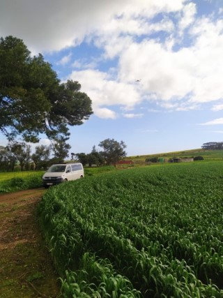
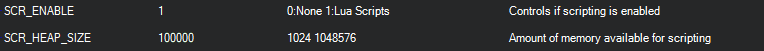
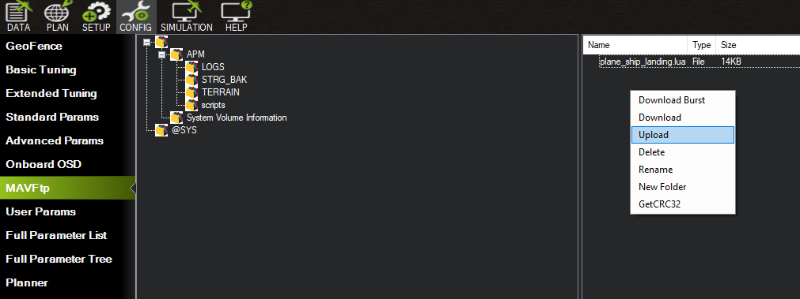
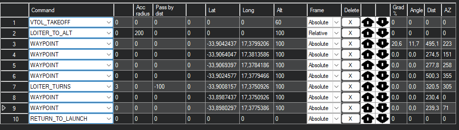

# Boat Landing

The 3D Tactical System tracker is designed to be used in harsh and demanding enviroments. Besides its rugged build it has functionality that allows it to be used on a moving or floating platforms. There are two challanges that need need to adress when conducting a flight mission from a moving plaftom:

* The home(RTL location) needs to be updated according to the position of the ground control station or platfrom. This will ensure the UAV is alway able to return home and land succesfull without any pilot aid. 
* The UAV needs to be able take off, approach and land on a platfrom with very limited space, superstructure and other obsticals. 

> **Note** 
The Boat Landing functionality is suported for Quad-Plane UAV's only

# Equipment Setup

In adition to the standard [Setup](https://) the following should be considered:

* The base of the antenna tracker should point towards the front of the moving platform. Carefull note of the orentation and position should be taken before flight. Image 
* The *Home Locaiton* is fixed relative to the position and orentation of the antenna tracker. This means that if the antenna tracker is rotated by 15 deg the *Home location* will move in proportion.
* If the base of the antenna tracker is disturbed during a flight it should be returned to its original position and orientation before an RTL mode is activated.
* the orentation of the antenna tracker does not effect its tracking accuracy.

 

## Enabling Scipting on the Flight Controller

An additional script will need to be added to the flight controller to enable the boat landing functionality. By default the flight controler has scripting disabled. The following parameters will need to be changed:

|    Parameter       | Value            | Description                                           |
| -------------      |:-------------    | :-----                                                |
| SCR_ENABLE         | 1                | Enable Lua sripting on the flight controller          |
| SCR_HEAP_SIZE      | 100000           | Provide enough memory to allow the script to run      |

Ensure the parameters are saved and writen to the flight controller

Dowload the ship landing script from [here](uploads/documents/plane_ship_landing.lua) and upload it to the scripts file on the SD card of the flight controller. The MAVFtp for the file transfer. The flight controller. The flight controller will need a reboot to run the script. 

To ensure the script is active check the *messages* tab for the following messages:

|    Message       | Description                                                         |
| -------------      | :-----                                                            |
|    PreArm: Ship: no beacon    |  The UAV has lost connection with the antenna tracker. The UAV will not arm.  |
| Have beacon     |  Esstablished connection to the antenna tracker      |

# Ship Landing Function

The ship landing script only effects the *AUTO*, *RTL* and *Q_RTL* flight modes. There is no behaviour change applied to *QLOITER*, *QHOVER*, *FBWA*, *FBWB*, *CRUISE* ex.

## Take-Off
During an *Auto* take-off, while in Quad-mode, the  UAV will match the velocity of the moving base until the transition altitude. This will ensure the UAV follows a 'vertical' path relative to the moving platfrom to avoid any platfrom superstructure.

## RTL

The RTL is a pilot-controlled function. If an RC connection is established the pilot is able to control and adjust some characteristics of the UAV's landing. The pilot is able to control the timing of the RTL stages and can "pause" the RTL in each stage untill conditions are considered appropriate to contiue. The RTL stage can be termintated at any point point and the previous stage initiated again. 

If an RC connection is not established the UAV will transition through each stage automatically without delay. 

 The RTL function is performed in four stages.

1) **Return Home -** Once the *RTL* is initiated the UAV assends to the **RTL_HOLD_ALT** and begins its return to the *Home Location*. 
2) **Hold-off Position -** When the UAV reaches a distance of about 2 x the **RTL_RADIUS** from the *Home Locaiton*  it will enter the *hold-off postion* stage. The UAV will loiter in close proximity to the moving platform maintaing a ALT_HOLD_RTL altitude. On input from the pilot the UAV will begin the *Platform Approch* stage.
3) **Platform Aproach -** The UAV will continue loitering but desend down to an altitude set by ALT_HOLD_RTL. On input from the pilot the UAV will begin the *Q-Land stage. 
4) **Q-Land -** The UAV will approach the platform at an angle defined by **SHIP_LAND_ANGLE**. It will transiton to to Q-RLT and begin a final decent to the platform. The UAV will continue to match the platform velocity to ensure an accurate landing. 

## Pilot Input and Control

During the RTL procedure the pilot controls the stage of the RTL according to the position of the throttle.

Throttle stick controls:
* Throttle at 40% or above:  Hold-off Position 
* Throttle below 40% and above 10%: Platform Approach
* Throttle below 10% : Q-Land

> **Note** the transition altitude is set using **Q_RTL_ALT**

# UAV Parameters

To ensure the script is active check the *messages* tab for the following messages:

|    Message       | Description                                                         |
| -------------      | :-----                                                            |
|    PreArm: Ship: no beacon    |  The UAV has lost connection with the antenna tracker. The UAV will not arm.  |
| Have beacon     |  Esstablished connection to the antenna tracker      |

# Flight Plan 

Bellow shows an example of a test flight mission

