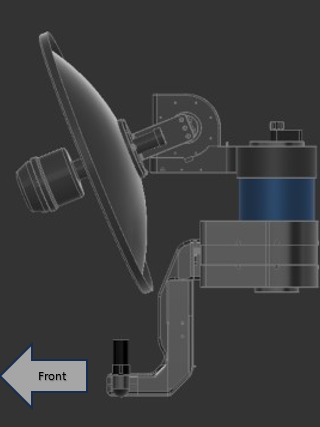
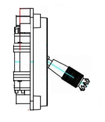

# Boat Landing

The 3D Tactical System tracker is designed to be used in harsh and demanding enviroments. Besides its rugged build it includes functionality that allows it to be used on a moving or floating platforms. In order to conduct a flight mission in such an enviroment. ther are two main challanges that need need to overcome.

* The home(RTL location) needs to be updated according to the position of the ground control station or platfrom. This will ensure the UAV is alway able to return home and land succesfull without pilot aid. 
* The UAV needs to be able take off, approach and land on a platfrom with very limited space, avoiding superstructure and other obsticals. 

This document will descripte the and preparation required to perform such a mission. 

note! The Boat Landing functionality is suported for Quad-Plane (VTOL) UAV's only

## Equipment Setup

In adition to the standard antenna tracker [Setup](setup.md) the following should be considered:

* The base of the antenna tracker should point towards the front of the moving platform. Carefull note of the orentation and position should be taken before flight.
* The *Home Locaiton* is fixed relative to the position and orentation of the antenna tracker. This means that if the antenna tracker is rotated by 15 deg the *Home location* will move in proportion.
* If the base of the antenna tracker is disturbed during a flight it should be returned to its original position and orientation before an RTL mode is activated.
* The orentation of the antenna tracker does not effect its tracking accuracy.

 

## Enabling Scipting on the Flight Controller

An additional script will need to be added to the flight controller to enable the boat landing functionality. By default the flight controler has scripting disabled. The following parameters will need to be changed:

|    Parameter       | Value            | Description                                           |
| -------------      |:-------------    | :-----                                                |
| SCR_ENABLE         | 1                | Enable Lua sripting on the flight controller          |
| SCR_HEAP_SIZE      | 100000           | Provide enough memory to allow the script to run      |

Ensure the parameters are saved and writen to the flight controller

Dowload the ship landing script from [here](uploads/documents/plane_ship_landing.lua) and upload it to the 'scripts' file on the SD card of the flight controller. MAVFtp through Mission Planner can be used for the file transfer. The flight controller will need a reboot to run the script. 

## Ship Landing Function

The ship landing script only effects the *AUTO*, *RTL* and *Q_RTL* flight modes. There is no behaviour change applied to *QLOITER*, *QHOVER*, *FBWA*, *FBWB*, *CRUISE* ex.

### Take-Off
During an *Auto* take-off, while in Quad-mode, the  UAV will match the velocity of the moving base until the transition altitude. This will ensure the UAV follows a 'vertical' path relative to the moving platfrom to avoid any platfrom superstructure.

### RTL

The RTL is a pilot-controlled function. If an RC connection is established the pilot is able to control and adjust some characteristics of the UAV's landing. The pilot is able to control the timing of the RTL stages and can "pause" the RTL in each stage untill conditions are considered appropriate to contiue. The RTL stage can be termintated at any point point and the previous stage initiated again. 

If an RC connection is not established the UAV will transition through each stage automatically without delay. 

 The RTL function is performed in four stages.

1) **Return Home -** Once the *RTL* is initiated the UAV assends to the **RTL_HOLD_ALT** and begins its return to the *Home Location*. 
2) **Hold-off Position -** When the UAV reaches a distance of about 2 x the **RTL_RADIUS** from the *Home Locaiton*  it will enter the *hold-off postion* stage. The UAV will loiter in close proximity to the moving platform maintaing a ALT_HOLD_RTL altitude. On input from the pilot the UAV will begin the *Platform Approch* stage.
3) **Platform Approach -** The UAV will continue loitering but desend down to an altitude set by ALT_HOLD_RTL. On input from the pilot the UAV will begin the *Q-Land stage. 
4) **Q-Land -** The UAV will approach the platform at an angle defined by **SHIP_LAND_ANGLE**. It will transiton to to Q-RLT and begin a final decent to the platform. The UAV will continue to match the platform velocity to ensure an accurate landing. 

## Pilot Input and Control

During the RTL procedure the pilot is able to control the stage of the RTL according to the position of the throttle.

Throttle stick controls:

|          |                                       |                                            |
| -------------      | :-----                                 |        -----                         |
| Throttle at 40% or above         |    Transition to or remain in **Hold-off Position** stage |    |
| Throttle below 40% and above 10% |     Transition to or remain in **Platform Approach** stage |   |
| Throttle below 10%            |       Transition to or continue  **Q-Land** stage |  |

There are 2 standard Q-Plane abilities that should be enabled to provide the pilot with additional control:

* **Q_OPTIONS bit 15:** This enables throttle land control.  When set the pilot can control the climb and descent rate during VTOL take of and landing  It is activated if the throttle is momentarily moved above 70%. The feature can be used to abort a the Q-Land stage. If the UAV climbs up past the **Q_RTL_ALT** approach altitude then the aircraft will go back to loitering at the hold-off location at **Q_RTL_ALT**.
 
* **Q_OPTIONS bit 17:** This enables horizontal repositioning The pilot can manually reposition the aircraft horizontally while landing. While repositioning the decent will pause. 

## Messages 

During the operation of the script the following messages may appear in the  *messages* tab:

|    Message       | Description                                                                                   |
| -------------      | :-----                                                                                    |
| PreArm: Ship: no beacon    |  The UAV has lost connection with the antenna tracker. The UAV will not arm.     |
| Have beacon                   |  Esstablished connection to the antenna tracker                                |
| Could not find # parameter     |  Script was not able to access the FC parameters. Reboot the UAV.
| Descending for approach       | Transitioned from Hold-off Position stage to Platform Approach                |
| Climbing for holdoff          | Transition from Platform Approach to Hold-off Position                        |
| Starting approach           | Transition from Platfrom Approach to Q-Land                                   |
| Aborting landing              | Transition form Q-Land to Hold-off Position                                   |
| Reached target altitude       | If **RTL_HOLD_ALT** is reached in Hold-off Position stage or **Q_RTL_ALT** is reached in Platform Approach stage|
| Set follow offset (-10.82,3.29,0.46) | Set the *Home Location* offset values                                    |
| Internal Error:#              | Script run error. Script will automaticly attempt a restart                   |

## Home Locaiton Offset

It is important to set the home location offset for the landing point relative to the antenna tracker. These values are in meters, in front-right-down format. Place the aircraft in the correct landing location with the antenna tracker setup and operational,  set the parameter SHIP_AUTO_OFS to 1. When this parameter is set to 1 the ship landing lua script will calculate the right offset values and set them in the **FOLL_OFS_X**, **FOLL_OFS_Y** and **FOLL_OFS_Z** values. The **SHIP_AUTO_OFS** value will reset to 0 automatically. 

It is recommended that the method of setting **SHIP_AUTO_OFS** = 1 is used to get the location before each flight. Look carefully at the message it gives when this parameter is set(use the Messages tab in MissionPlanner):

Set follow offset (-10.82,3.29,0.46)

That message confirms that the X, Y and Z offset has calculated. Check that they are reasonable, paying close attention to the Z offset. If you get a bad Z offset (ie. a long way off from the actual height difference between the beacon and the aircraft) then you may need to reboot the beacon and/or aircraft to cope with GPS altitude drift.

## Land Angle

You can choose the approach angle of the aircraft to the ship. The default is **SHIP_LAND_ANGLE** = 0 which means land from behind the ship. A value of 90 will mean that the aircraft approaches the ship from the left-hand side. A value of -90 means it approaches from the right-hand side. A value of 180 means the aircraft will approach the landing from the front of the ship.

You should choose a **SHIP_LAND_ANGLE** value to avoid obstructions on the ship, for example masts. The angle should also be chosen such that if you need to abort the landing, flying straight ahead will leave plenty of clearance to obstacles.

*SHIP_LAND_ANGLE = -45*

*SHIP_LAND_ANGLE = 0*

## UAV Parameters

To ensure the script is active check the *messages* tab for the following messages:

|    Parameter       | Value            | Description                                           |
| -------------      |:-------------    | :-----                                                |
| RTL_RADIUS         | 100              | Enable Lua sripting on the flight controller          |
| ALT_HOLD_ALT       | 100              | Provide enough memory to allow the script to run      |
| Q_RTL_ATL          | 50               | 
| SHIP_ENABLE        | 1                |
| SHIP_LAND_ANGLE    | #                | Aproach from the stern of the ship for landing approach
| SHIP_AUTO_OFS      | #                | Auto culculates home location offset from atenna tracker
| Q_OPTIONS          | set bit 5            | Always QRTL 
| Q_OPTIONS          | set bit 15           | enables throttle land control
| Q_OPTIONS          | set bit 17           | enables horizontal repositioning
| FS_LONG_ACTN       | 1                    | RTL
| Q_RTL_MODE         | 0                    | Execute and normal RTL
| RTL_AUTOLAND       | 0                    | do not automatically begin landing sequence 
| FOLL_ENABLE        |
| FOLL_SYSID         | 17                   | System Id of the antenna tracker

| Q_TRANS_DECEL      |

> **Note** the transition altitude is set using **Q_RTL_ALT**

## Flight Plan 

Bellow shows an example of a test flight mission

