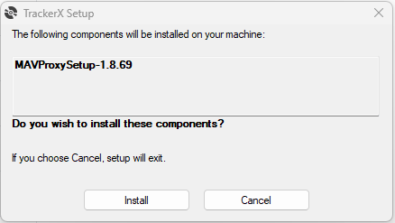

# Setup


This section provides a comprehensive overview of the telemetry communication network architecture, detailing the essential settings and programs necessary for its operation. Proper configuration of the telemetry network is crucial to guarantee the success of the boat landing sequence. The network is comprised of three key nodes: the UAV, the antenna tracker, and the mission planner ground station. It's imperative that each node maintains a bidirectional connection with the others to facilitate uninterrupted telemetry data exchange. Subsequent sections will meticulously outline the connection settings required for each device, ensuring a robust and seamless telemetry link.

## UAV Hardware Connections


The UAV is equipped with a singular telemetry connection to the flight controller via Serial 1. This connection interfaces with the S2 Ethernet-to-Serial module, facilitating the broadcast of data across the radio network. Additionally, the TX line from Serial 1 is directly routed to the radio. This second unidirection link does not get used in this new configuration.  The hardware connections of the UAV are illustrated in the figure below.


## Ground Station

Upon receipt by the ground station radio, the telemetry data is channeled through Mavproxy. Serving as an efficient routing and forwarding mechanism, Mavproxy facilitates the connection between the antenna tracker, the Mission Planner ground station, and the UAV. This ensures a seamless data flow across the network. The diagram below offers a detailed view of the data routing from an IP network perspective


Mavproxy acheives the routing by configuration with the following start up instruction.

Mavproxy command:


```bash
    mavproxy --master=udpout:192.168.2.3:20108 --master=udpout:192.168.2.5:23 --out=udpout:192.168.2.5:23 --out=udpout:192.168.2.25:26
```


## TackerX Software
### Installation

On installation of the TrackerX software the Mavproxy will automatically be installed.

-> Run the Setup.exe


-> Install Mavproxy 1.8.6.9



-> Once Mavproxy is installed, complete the installation of TackerX


The mavproxy forwarding software can be run via the TrackerX software. 

### Operation

Within the TrackerX software the TelemProxy tab can be used to start or stop the Mavproxy console. 


Once started a Mavproxy console will open. if this window is closed, Mavproxy will continue to run in the background until the "Stop" button on the TrackerX software is clicked. If the UAV and antenna tracker are connected then Link 1 and 2 will be active.


The status icon will indicate if Mavproxy is operating correctly.


The antenna tracker or Mission Planner ground control will not recieve any UAV telemetry data untill Mavproxy is active. The "UAV Connected" indicator will show if this connection has been esstabished or not.  


If both Link 1 and Link 2 are active within Mavproxy, Mission Planner can be opened. There should be two vehicles on the connection list. System 17 is the antenna tracker, while System 1 represents the UAV. To control the UAV, ensure the correct vehicle is selected.


